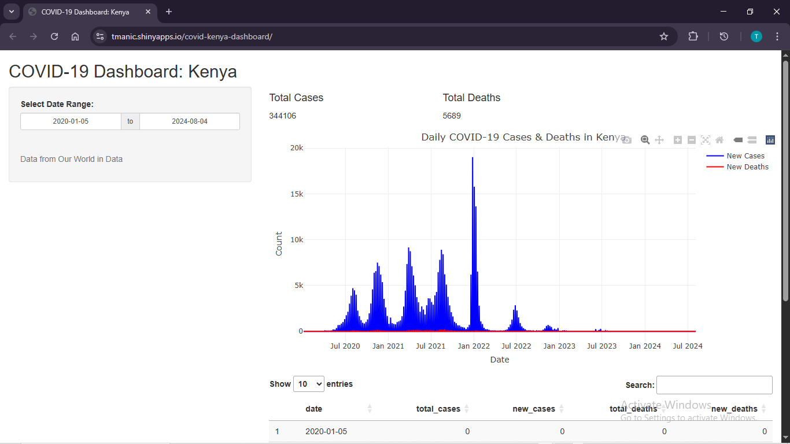

# COVID-19 Kenya Dashboard

This is an interactive Shiny dashboard built using R to visualize COVID-19 case trends in Kenya.

## Features

-   Live Plotly visualizations
-   Filterable time range
-   Cleaned & wrangled data using `tidyverse`
-   Hosted via shinyapps.io

## Live Demo

👉 [Click here to view the live dashboard](https://tmanic.shinyapps.io/covid-kenya-dashboard/)

## Screenshot

## Tools Used!

-   R
-   Shiny
-   Plotly
-   Tidyverse

## License

MIT
